<div align="center">
  

  # Bruno Pizza — Production

  **Application desktop locale pour transformer un plan de production Excel en parcours de fabrication clair et exploitable en atelier.**

  React · TypeScript · Electron · Express · SQLite
</div>

## Le projet

Bruno Pizza répond à un besoin concret : préparer une production répartie
entre plusieurs distributeurs, puis guider sa fabrication pizza par pizza.
L’application importe un fichier Excel, le rapproche d’un catalogue métier et
propose trois espaces complémentaires :

- un **tableau de production** avec les quantités par variété et distributeur ;
- un **parcours atelier** avec recette, photo, progression et navigation ;
- des **paramètres métier** pour gérer pizzas, ingrédients et distributeurs.

La version 1.1.3 fonctionne entièrement en local. Excel reste l’unique source
de production ; l’intégration Adial n’entre pas encore dans son périmètre.

## Points forts

- import et validation d’un plan de production `.xlsx` ou `.xls` ;
- contrôle des en-têtes, doublons, quantités et totaux avant affichage ;
- catalogue SQLite modifiable avec recettes ordonnées et photos ;
- interface sombre ou claire, pilotable au clavier et zoomable ;
- persistance locale séparée des fichiers installés ;
- serveur Express limité à `127.0.0.1` avec port desktop dynamique ;
- origine Electron stable pour préserver la session entre les lancements ;
- tests frontend, backend et desktop exécutés automatiquement par GitHub.

## Aperçu

Captures réalisées avec des données locales de démonstration.

| Tableau de production | Parcours de fabrication |
| --- | --- |
| 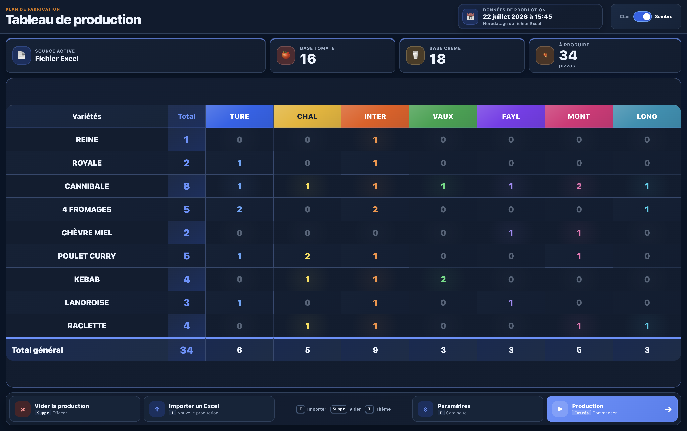 |  |

| Catalogue des pizzas | Gestion des distributeurs |
| --- | --- |
| 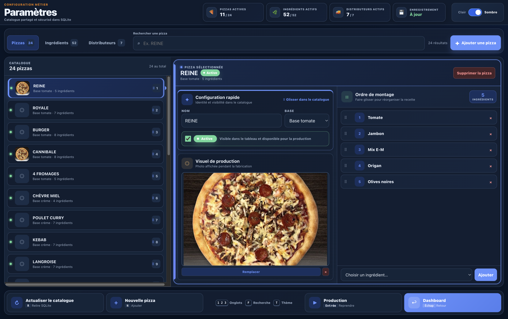 | 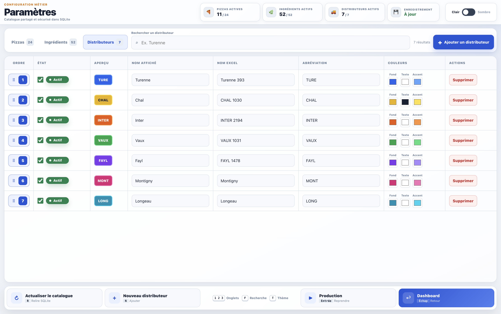 |

<details>
  <summary>Voir la galerie complète</summary>

| Import Excel | Tableau clair |
| --- | --- |
| 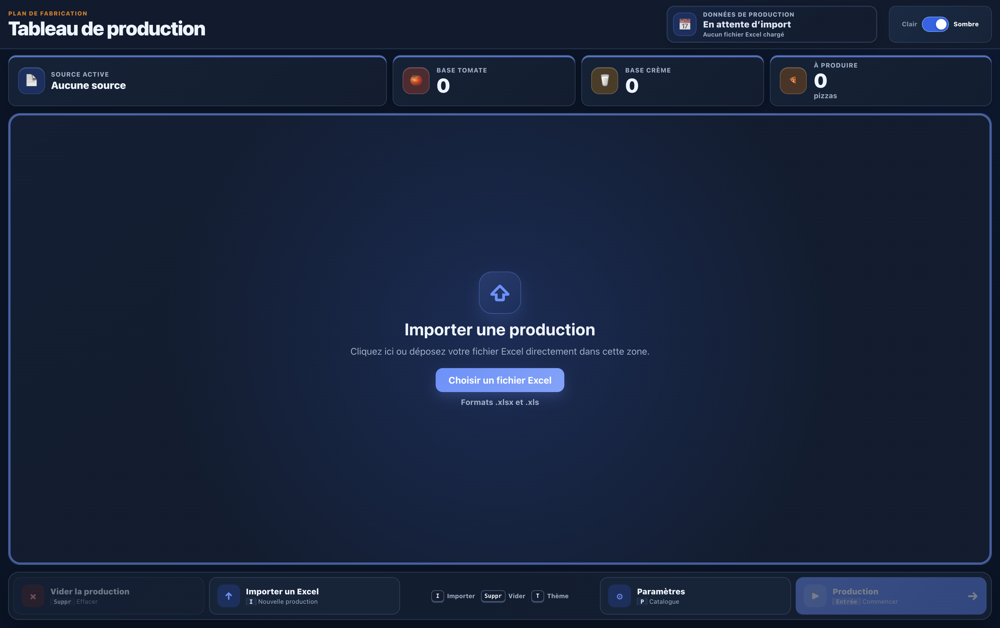 | 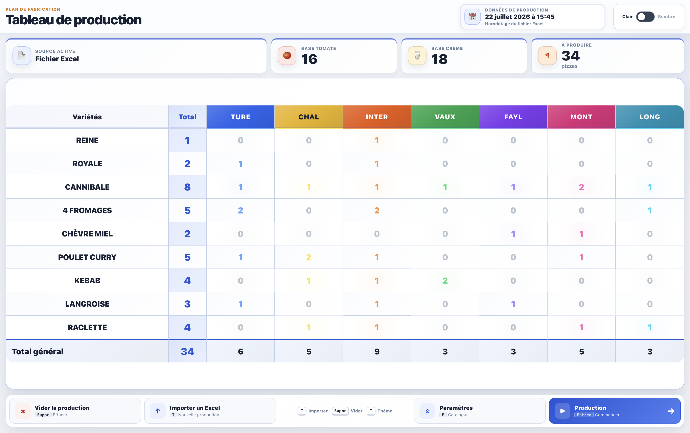 |

| Import Excel clair | Parcours clair |
| --- | --- |
| 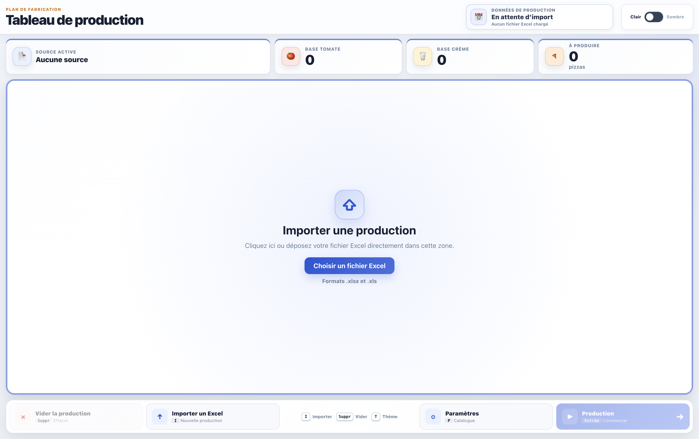 |  |

| Production terminée | Production terminée en clair |
| --- | --- |
| 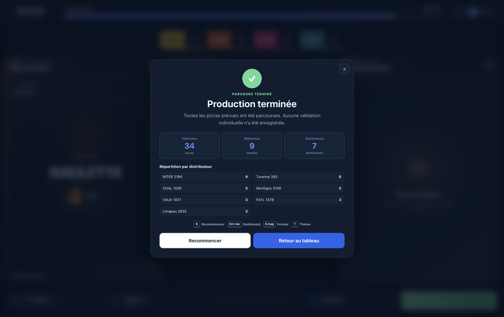 | 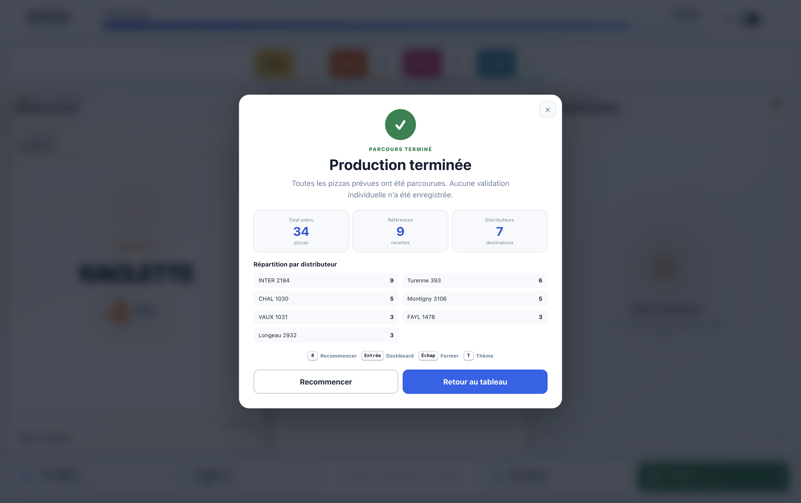 |

| Configuration pizza claire | Ingrédients |
| --- | --- |
| 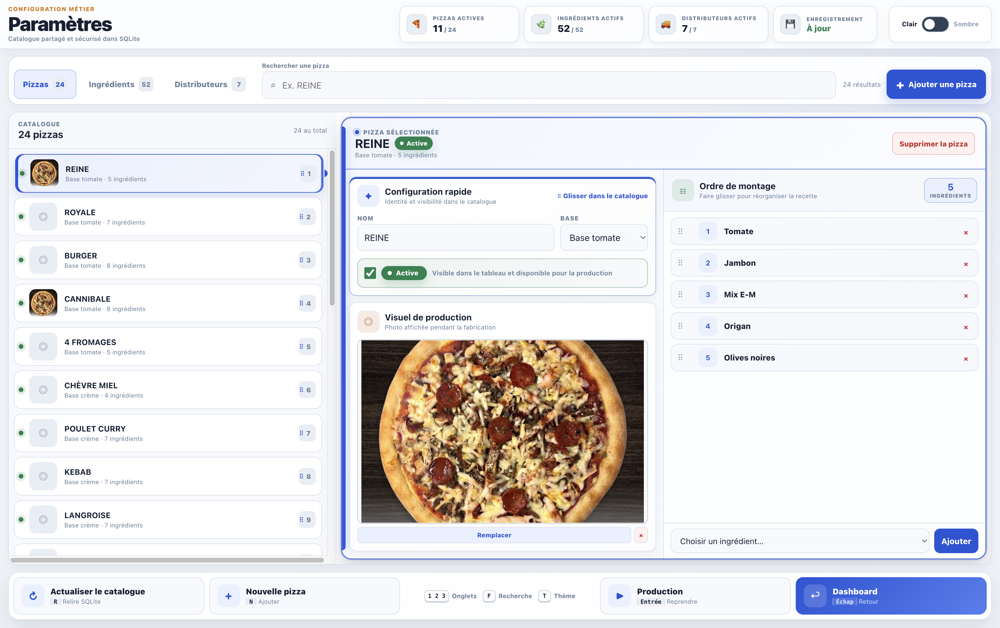 | 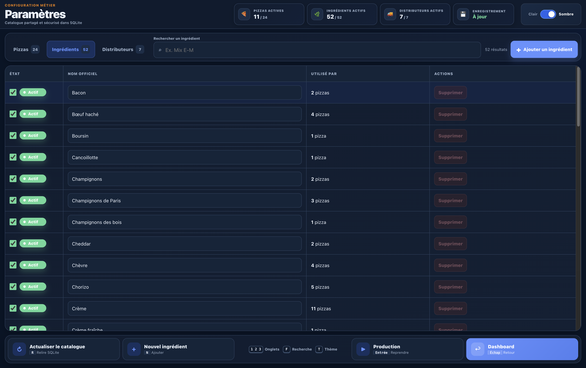 |

| Ingrédients clairs | Distributeurs |
| --- | --- |
| 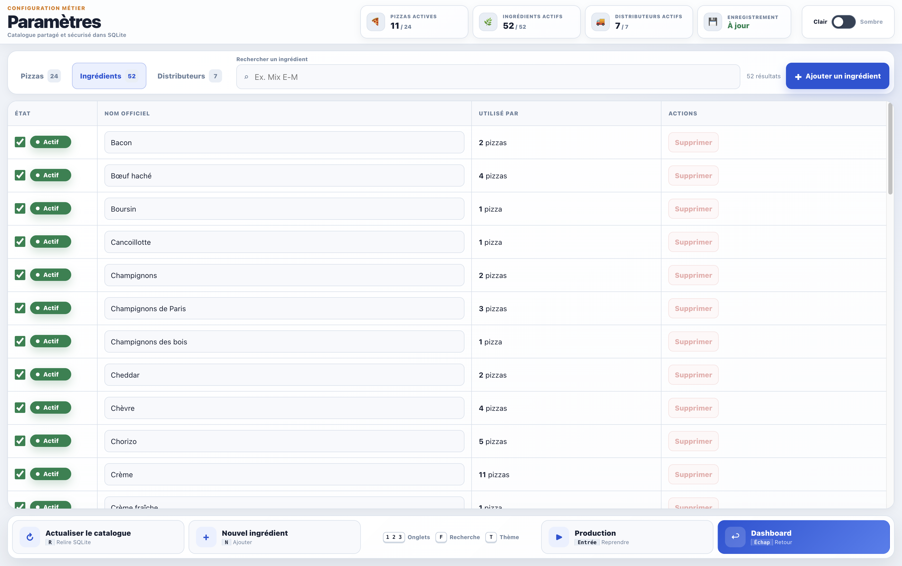 | 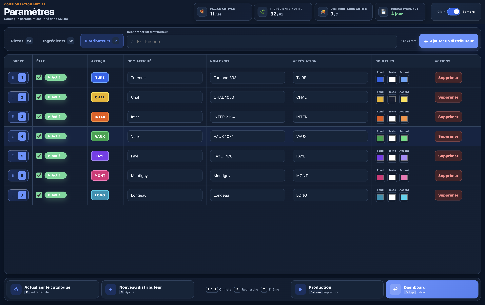 |
</details>

## Architecture

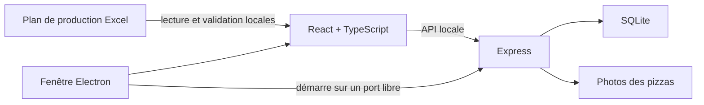

En développement, Vite et Express fonctionnent séparément. Dans l’application
desktop, Electron démarre le backend local et affiche le frontend compilé via
l’origine interne `bruno-pizza://app`.

## Essayer l’application

La page [Releases](https://github.com/JulienEsbt/bruno-pizza-production/releases)
contient les livraisons disponibles :

- `Appli-Montage-Setup-1.1.3.exe` pour Windows Intel/AMD 64 bits ;
- `Appli-Montage-1.1.3-macOS-Apple-Silicon.zip` pour les Mac M1 et suivants.

Ces versions sont actuellement non signées et destinées aux tests. Windows
SmartScreen ou macOS Gatekeeper peut donc demander une confirmation au premier
lancement.

## Installation du projet source

Prérequis : Git, Node.js 22.5 ou supérieur et npm 10 ou supérieur.

```bash
git clone https://github.com/JulienEsbt/bruno-pizza-production.git
cd bruno-pizza-production
npm ci
npm run install:all
cp frontend/.env.example frontend/.env
cp backend/.env.example backend/.env
```

### Développement web

Lancer le backend et le frontend dans deux terminaux :

```bash
npm run dev:backend
```

```bash
npm run dev:frontend
```

L’interface est accessible sur `http://localhost:5173` et l’API sur
`http://127.0.0.1:3001`.

### Développement desktop

Pour construire puis ouvrir l’application Electron depuis les sources :

```bash
npm run desktop:start
```

## Qualité et construction

| Commande | Rôle |
| --- | --- |
| `npm run check` | Exécute le lint, le typage et les tests |
| `npm run build` | Construit le frontend et le backend |
| `npm run release:check` | Valide intégralement une livraison |
| `npm run desktop:package` | Produit un paquet pour le système courant |
| `npm run make:windows` | Produit l’installateur Windows depuis Windows |
| `npm start` | Sert le frontend compilé et l’API dans un seul processus |

## Données locales

Le dépôt ne contient aucune base utilisateur, photo de production, variable
d’environnement réelle ou feuille Excel importée.

| Mode | Emplacement des données |
| --- | --- |
| Projet source | `backend/data/` |
| Windows | `%APPDATA%\Bruno Pizza\data\` (conservé pour les mises à jour) |
| macOS | `~/Library/Application Support/Bruno Pizza/data/` (conservé pour les mises à jour) |

Une nouvelle base est automatiquement créée depuis le catalogue initial lors
du premier lancement. Une mise à jour du programme réutilise les données déjà
présentes sans les inclure dans l’installateur.

## Documentation

- [Guide utilisateur](docs/GUIDE_UTILISATEUR.md)
- [Format du fichier Excel](docs/FORMAT_EXCEL.md)
- [Installation et exploitation](docs/INSTALLATION_ET_EXPLOITATION.md)
- [Architecture technique](docs/ARCHITECTURE_TECHNIQUE.md)
- [Historique des versions](CHANGELOG.md)

## Sécurité

Cette application est conçue pour un usage local de confiance. Son serveur ne
doit pas être exposé directement sur Internet ou sur un réseau non maîtrisé
sans authentification, HTTPS et règles réseau supplémentaires.

## Licence

Ce projet est distribué sous licence [MIT](LICENSE).

© 2026 Julien Esterbet
