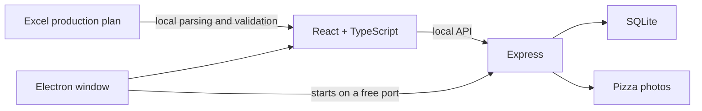

[English](README.md) · [Français](README.fr.md)

<div align="center">
  

  # Bruno Pizza — Production

  **A local-first desktop application that turns Excel production plans into a clear, practical manufacturing workflow.**

  React · TypeScript · Electron · Express · SQLite
</div>

## Overview

Bruno Pizza was built for a real operational need and is installed in an active
production environment. It helps prepare production across several distributors
and guides operators through the manufacturing process one pizza at a time.

The application imports an Excel production plan, validates it against a local
business catalog and provides three complementary workspaces:

- a **production dashboard** with quantities by product and distributor;
- a **workshop workflow** with recipes, photos, progress tracking and keyboard
  navigation;
- **business settings** for pizzas, ingredients and distributors.

Version 1.1.3 runs entirely on the user's computer. Excel remains the only
production source; direct Adial integration is not part of the current scope.

## Product highlights

- imports and validates `.xlsx` and `.xls` production plans;
- checks headers, duplicates, quantities and totals before displaying data;
- provides an editable SQLite catalog with ordered recipes and product photos;
- supports light and dark themes, keyboard controls and interface zoom;
- keeps user data separate from installed application files;
- binds the Express server to `127.0.0.1` and selects a free desktop port;
- uses a stable internal Electron origin to preserve the local session;
- runs frontend, backend and desktop tests in GitHub Actions;
- is documented, packaged and distributed for Windows and macOS.

## Screenshots

The screenshots use local demonstration data.

| Production dashboard | Manufacturing workflow |
| --- | --- |
|  |  |

| Pizza catalog | Distributor settings |
| --- | --- |
|  |  |

<details>
  <summary>View the complete gallery</summary>

| Excel import | Light dashboard |
| --- | --- |
|  |  |

| Light Excel import | Light workflow |
| --- | --- |
|  |  |

| Completed production | Completed production in light mode |
| --- | --- |
|  |  |

| Light pizza settings | Ingredient settings |
| --- | --- |
|  |  |

| Light ingredient settings | Distributor settings |
| --- | --- |
|  |  |
</details>

## Architecture



During web development, Vite and Express run separately. In the packaged
desktop application, Electron starts the local backend and serves the compiled
frontend through the internal `bruno-pizza://app` origin.

## Download

The [Releases](https://github.com/JulienEsbt/bruno-pizza-production/releases)
page contains the available builds:

- `Appli-Montage-Setup-1.1.3.exe` for 64-bit Intel/AMD Windows systems;
- `Appli-Montage-1.1.3-macOS-Apple-Silicon.zip` for Apple Silicon Macs.

The current builds are not code-signed. Windows SmartScreen or macOS Gatekeeper
may therefore ask for confirmation on first launch.

## Run from source

Requirements: Git, Node.js 22.5 or later and npm 10 or later.

```bash
git clone https://github.com/JulienEsbt/bruno-pizza-production.git
cd bruno-pizza-production
npm ci
npm run install:all
cp frontend/.env.example frontend/.env
cp backend/.env.example backend/.env
```

### Web development

Start the backend and frontend in separate terminals:

```bash
npm run dev:backend
```

```bash
npm run dev:frontend
```

The interface is available at `http://localhost:5173` and the API at
`http://127.0.0.1:3001`.

### Desktop development

Build and open the Electron application from source:

```bash
npm run desktop:start
```

## Quality and packaging

| Command | Purpose |
| --- | --- |
| `npm run check` | Run linting, type checks and tests |
| `npm run build` | Build the frontend and backend |
| `npm run release:check` | Validate a complete release candidate |
| `npm run desktop:package` | Package the application for the current system |
| `npm run make:windows` | Build the Windows installer on Windows |
| `npm start` | Serve the compiled frontend and local API together |

The continuous integration workflow runs the full release check on pushes and
pull requests targeting `main`.

## Local data

The repository contains no user database, imported Excel production plan,
production photo or real environment variable. The initial business catalog is
versioned intentionally so a fresh installation is usable immediately.

| Mode | Data location |
| --- | --- |
| Source project | `backend/data/` |
| Windows | `%APPDATA%\Bruno Pizza\data\` |
| macOS | `~/Library/Application Support/Bruno Pizza/data/` |

The application creates a new database from the initial catalog on first
launch. Program updates reuse existing data and do not include it in the
installer.

## Documentation

- [User guide — French](docs/GUIDE_UTILISATEUR.md)
- [Excel format — French](docs/FORMAT_EXCEL.md)
- [Installation and operations — French](docs/INSTALLATION_ET_EXPLOITATION.md)
- [Technical architecture — French](docs/ARCHITECTURE_TECHNIQUE.md)
- [Changelog](CHANGELOG.md)

## Security scope

This application is designed for trusted local use. Its Express server must not
be exposed directly to the Internet or to an untrusted network without adding
authentication, HTTPS and appropriate network controls.

## License

This project is available under the [MIT License](LICENSE).

© 2026 Julien Esterbet
